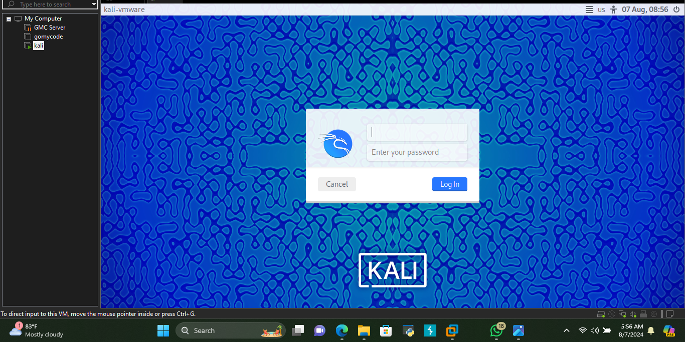
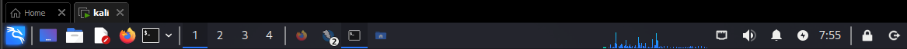
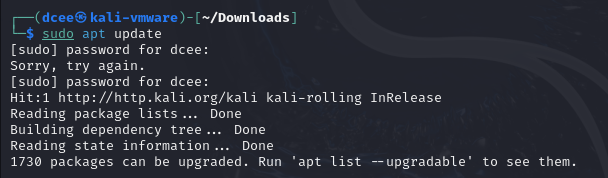
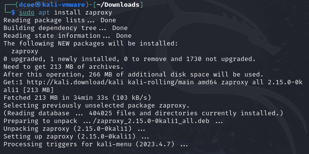
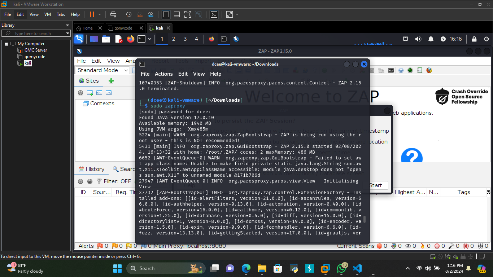
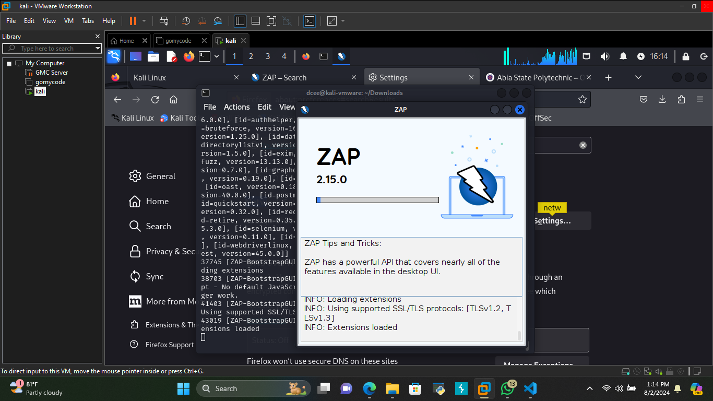
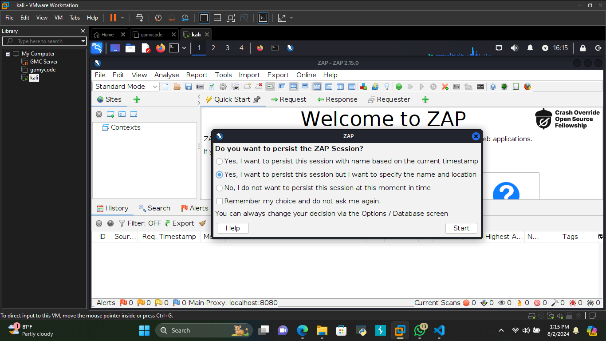
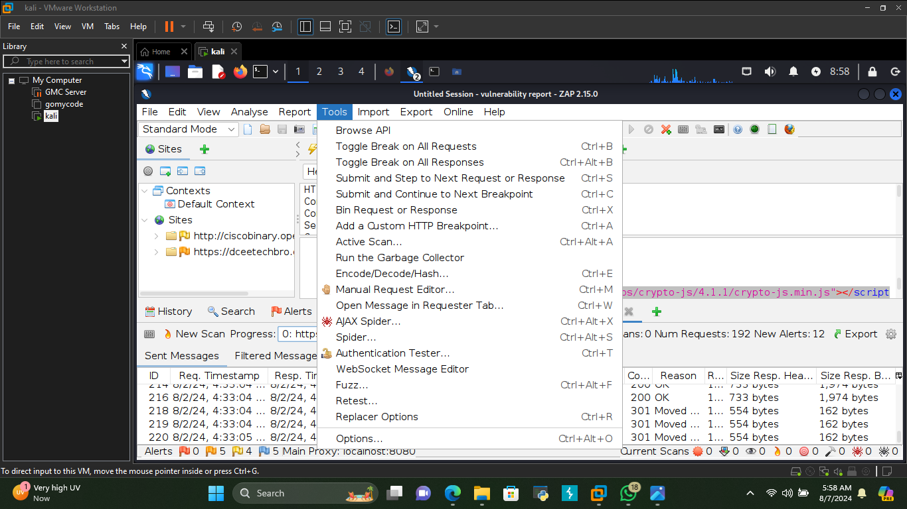
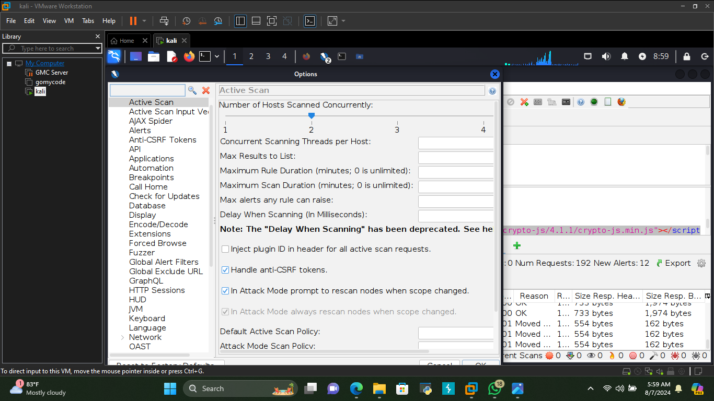
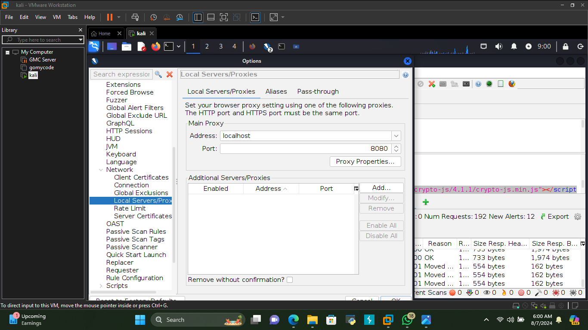

<h1>Gmcfinalproject-2ndphase</h1>
<h1>Step by step on how to set up ZAP using Kali Linux as the OS "Opreating System" beginners guide</h1>
i. Launch your Kali Linux and input your "username and password"

ii. Navigate to the Kali Linux terminal and click on it,in the image below the terminal icon is the sixth icon with a "$ and dark background"

iii. Once the terminal is open ensure your OS is up-to-date "sudo apt update"

iv. Install ZAP "sudo apt install zaproxy" which will help

v. Launch your zaproxy "sudo zaproxy" to begin the set up of your zap 

vi. Once ZAP is initializing you should be redirected to a sub new screen

<h1>Configure your ZAP to your preferred understanding to either persist sessions or not, you can choose to specify the name and location or let ZAP default settings specify</h1>

i. Navigate to your ZAP tools to configure your browser to use ZAP as a proxy

ii. Locate the options on your tools drop-down click on it, once open you should be redirected to the image interface below

iii. Scroll down on this same interface and loacate the "Network" on the Network drop-down click on "Local Server/Proxy" (typically localhost:8080) to configure ZAP as your browser proxy.
In ZAP, go to Tools > Options > Local Proxies to confirm proxy settings
Install the ZAP root certificate in your browser to intercept HTTPS traffic

